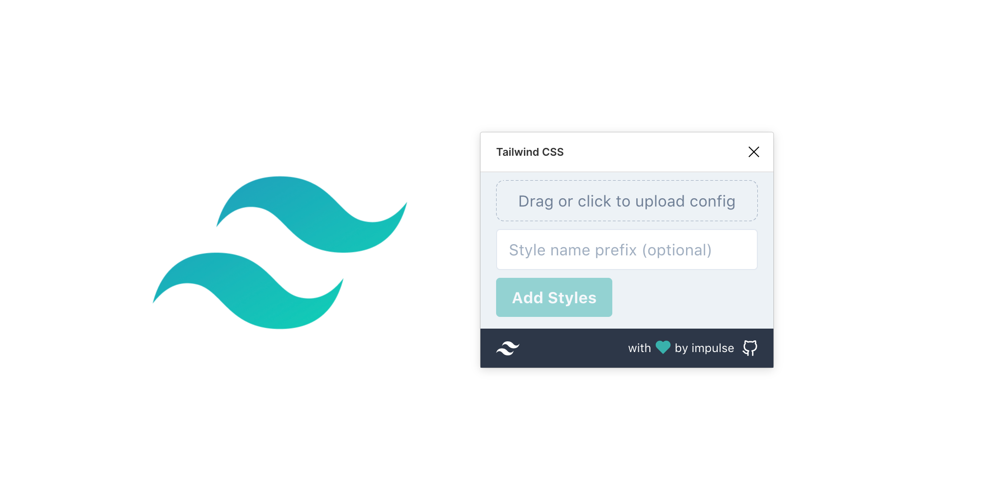

# TailwindCSS Figma Plugin

Make your life with Tailwind CSS and Figma easier.



## Development

1. First, install your dependencies:

   ```sh
   $ yarn install
   ```

2. The config offers either a dev or build script

   ```sh
   $ yarn dev
   $ yarn build
   ```

## License

MIT
